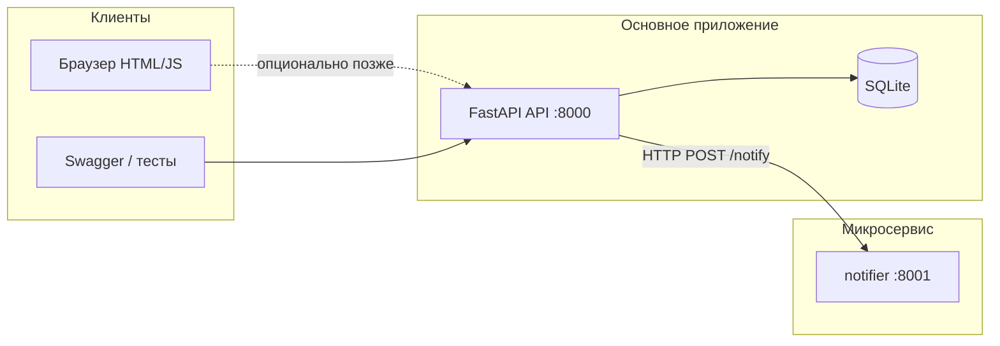

# Time Tracker — курсовой бэкенд (Python + FastAPI)

Рядом с вашим **браузерным** приложением (`index.html`, `app.js`, `styles.css`) этот проект закрывает типичные требования курса по **API, CRUD, JWT, тестам и Docker**, плюс отдельный **микросервис уведомлений** (минимальный).

## Что здесь есть (связь с заданием)

| Требование курса (по смыслу) | Реализация |
|------------------------------|------------|
| Тема «Time Tracker» | API для **задач** и **сессий учёта времени** (миллисекунды начала/конца, как на фронте). |
| REST API + CRUD | `GET/POST/PATCH/DELETE` для `/tasks`, `GET/POST/PATCH/DELETE` для `/sessions`. |
| Аутентификация (JWT) | `POST /auth/register`, `POST /auth/login` (JSON) или `POST /auth/token` (форма `username`/`password`). В Swagger: **Authorize** → только строка **access_token** (без слова Bearer). |
| Тесты (pytest) | `tests/test_api.py` — сценарии регистрации, CRUD задач и сессий, проверка 401 без токена. |
| Docker | `Dockerfile` для API, `notifier/Dockerfile`, `docker-compose.yml` — два сервиса. |
| Микросервис | Сервис **notifier** (`:8001`): `POST /notify`. Основной API после создания сессии **асинхронно** шлёт туда запрос (если задан `NOTIFIER_URL`). |
| База данных | **SQLite** (файл в Docker томе `/data/app.db`; локально по умолчанию `time_tracker.db` в каталоге запуска). |

**Этап 5 курса** (облако, CI/CD, интеграционные тесты всей системы) здесь **не** автоматизирован — при необходимости добавляется отдельно (GitHub Actions + деплой).

**Фронт** по-прежнему хранит данные в `localStorage` и умеет JSON-импорт/экспорт **без сервера**. Бэкенд — для отчёта и демонстрации API: в Swagger можно вручную завести те же сущности или в следующей итерации подключить `fetch` с фронта.

## Быстрый старт (без Docker)

```powershell
cd time_tracker_course_api
python -m pip install -r requirements.txt
python -m pytest tests -v
uvicorn app.main:app --reload --host 127.0.0.1 --port 8000
```

Открой в браузере: **http://127.0.0.1:8000/docs** — интерактивная документация OpenAPI.

## Docker Compose

```powershell
cd time_tracker_course_api
docker compose up --build
```

- API: **http://localhost:8000/docs**  
- Notifier: **http://localhost:8001/docs**  

Переменные (см. `docker-compose.yml`): `DATABASE_URL`, `JWT_SECRET`, `NOTIFIER_URL`.

## Краткая схема архитектуры



## Эндпоинты (кратко)

- `POST /auth/register` — тело JSON `{ "email", "password" }`.
- `POST /auth/token` — форма `username` (email), `password` → `{ "access_token", "token_type" }`.
- `/tasks`, `/sessions` — с заголовком Bearer; схемы тел в `/docs`.

Удачи на защите: покажи **работающий фронт** + **Swagger с CRUD** + **pytest** + **docker compose ps**.
